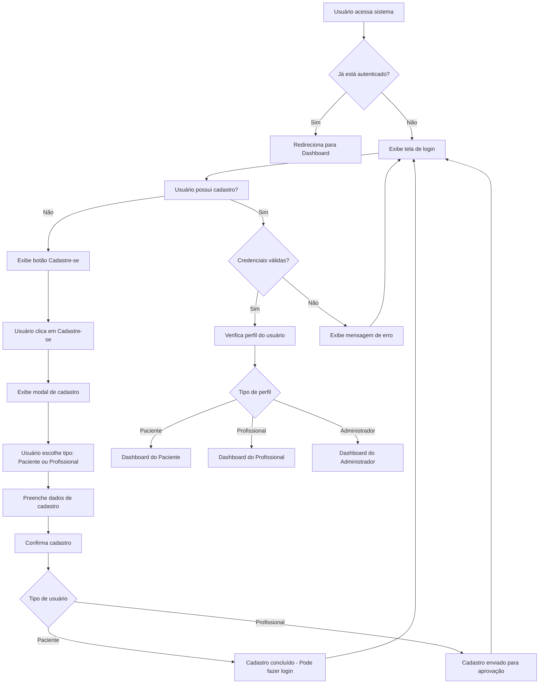
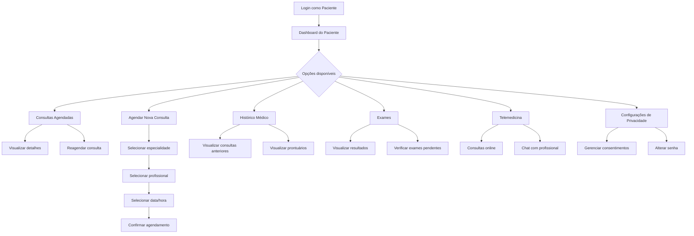
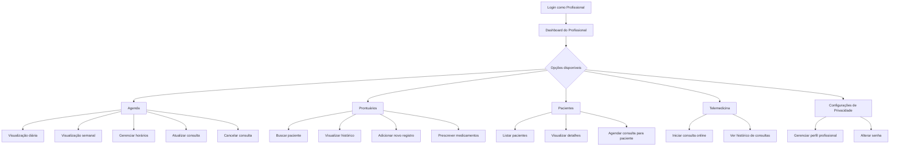
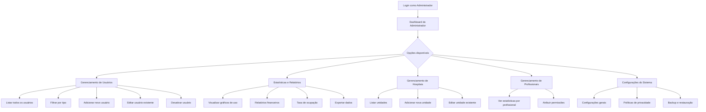
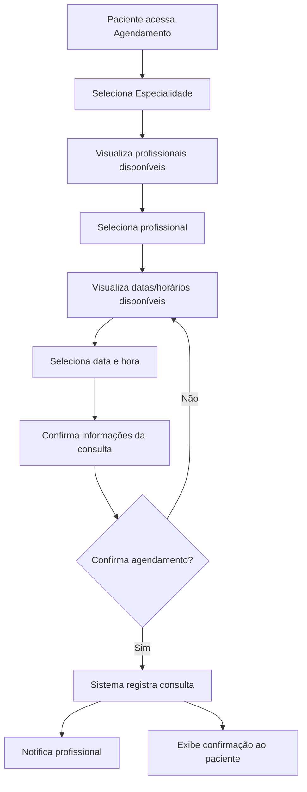
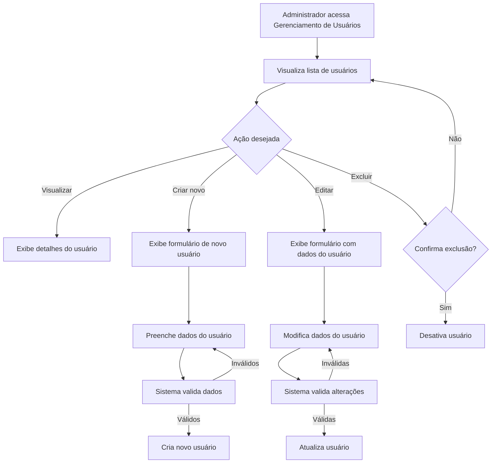
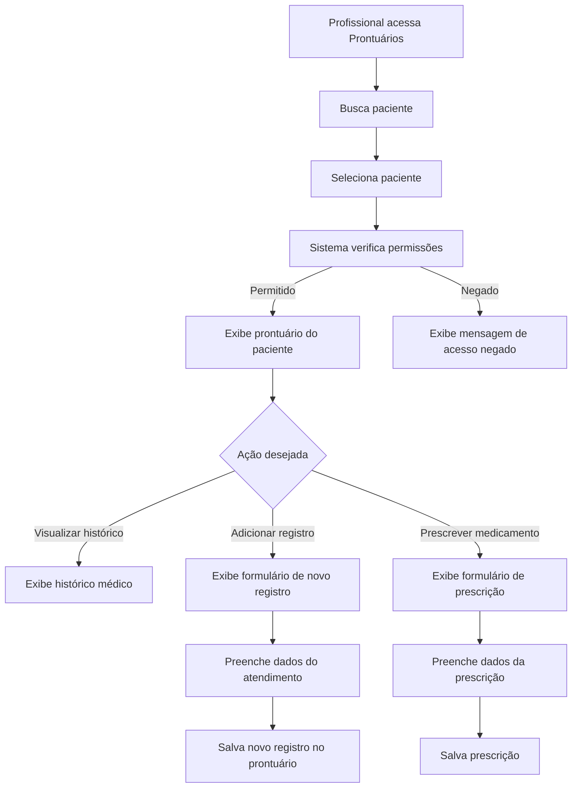
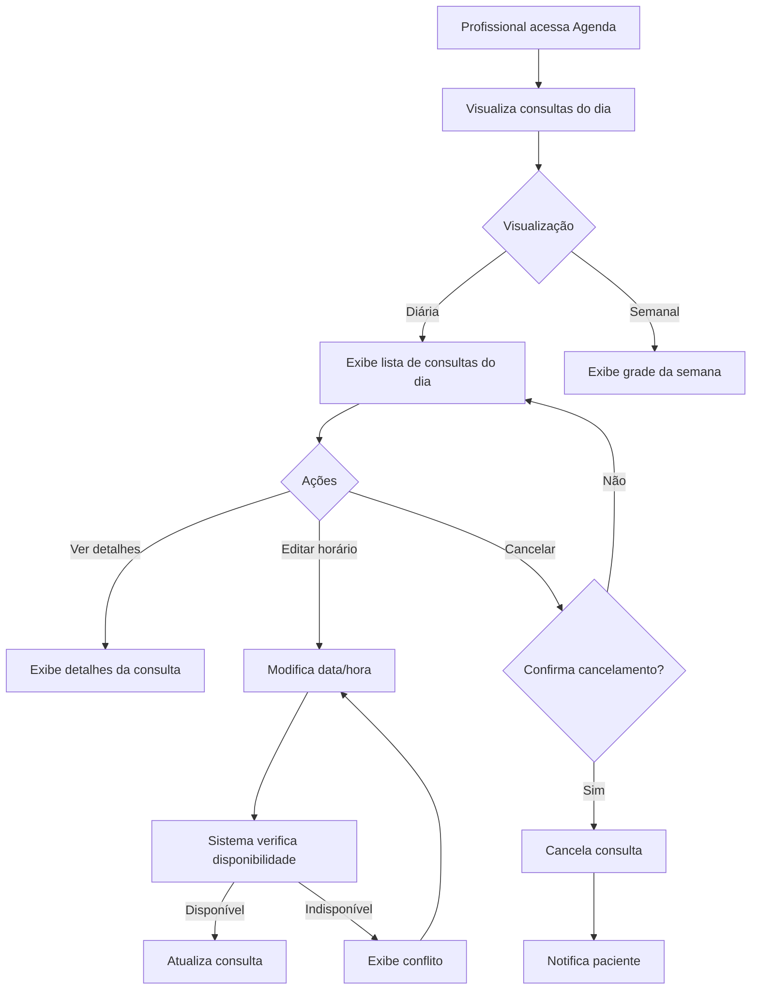
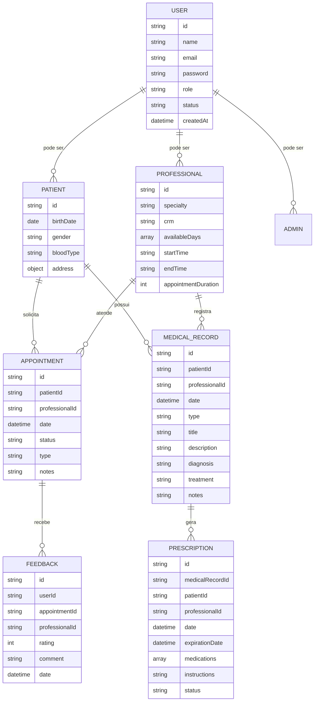

# Diagramas do Sistema de Gestão Hospitalar

Este documento contém os diagramas dos principais fluxos do Sistema de Gestão Hospitalar, usando a sintaxe Mermaid para fácil visualização e manutenção.

## Índice

1. [Fluxo de Autenticação](#fluxo-de-autenticação)
2. [Fluxo do Paciente](#fluxo-do-paciente)
3. [Fluxo do Profissional](#fluxo-do-profissional)
4. [Fluxo do Administrador](#fluxo-do-administrador)
5. [Fluxo de Agendamento de Consultas](#fluxo-de-agendamento-de-consultas)
6. [Fluxo de Gerenciamento de Usuários](#fluxo-de-gerenciamento-de-usuários)
7. [Fluxo de Acesso a Prontuários](#fluxo-de-acesso-a-prontuários)
8. [Fluxo da Agenda do Profissional](#fluxo-da-agenda-do-profissional)
9. [Modelo ER](#modelo-er-entidade-relacionamento)

---

## Fluxo de Autenticação

## Fluxo do Paciente

## Fluxo do Profissional

## Fluxo do Administrador

## Fluxo de Agendamento de Consultas

## Fluxo de Gerenciamento de Usuários

## Fluxo de Acesso a Prontuários

## Fluxo da Agenda do Profissional

## Modelo ER (Entidade-Relacionamento)

